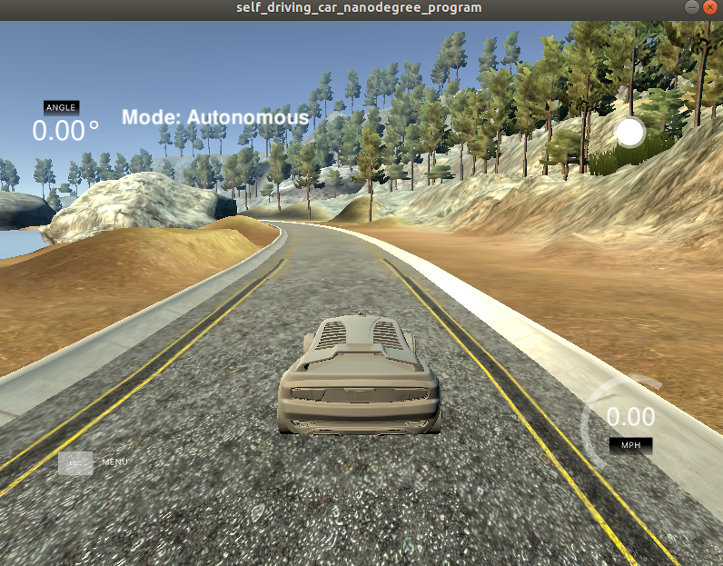

# CarND-Controls-MPC
Self-Driving Car Engineer Nanodegree Program

---

## Overview
In the project, I implemnented Model prodictive Control(MPC) method using C++ to make vehicle driving on the road and keep it on the center of road according to waypoints reference. Compared with PID Control, MPC is more approaching to the real world vehicle model and tune the controller more efficiently. 
The simulator is like following figure:


## The Kinematic Model
For the project, we work on a relatively simple type of model, the Kinematic models, which ignore tire force, gravity, and mass. At the low and moderate speeds, kinematic models often approximate the actual vehicle dynamics. 
For Kinematic model, in order to keep track with vihcle, the necessary state of vihcle include vihcle x's coordinate(x) and y's coordinate(y), orientation angle(psi) abd velocity(v). Then actutor control includes steering angle(delta) and acceleration(a). So the model combines the state and actuations from previous time step to calculate the current state and actutors based on the following update equations:


## Timestep length and Elapsed Duration(N & dt)
The timestep(dt) and number of timesteps(N) are hyperparameters need to tune. It is easy to undertand that MPC will have a better performance when dt is as small as possible and T is as large as possible. It will cause a increasing calculation. I tried 20 / 0.05 and 5 / 0.2 , 15/ 0.06, and 10 / 0.1(Udacity recommend). I found 10 / 0.1 can performance a great result and weigh the calucation amount and performance, I chose 10 / 0.1 for number of teimseteps and timestep respectively. 

## Polynomial Fitting and MPC Preprocessing
The waypoints the simulator provide is based on map's coordinate system. It will be easier to transform the waypoints from map's coordinate system to vehicle's coordinate system. The coordinate transform method can refer to the [link](http://farside.ph.utexas.edu/teaching/336k/Newtonhtml/node153.html). And also in order to simplify the process of fitting polynomial, I set the current vehicle's coordinates as origin(0,0) and the current orientation angle is zero. The way to achieve the goal like following code:
```cpp
for(uint i = 0; i < ptsx.size(); i++){
            dx = ptsx[i] - px; // shift x px = 0
            dy = ptsy[i] - py; // shift y py = 0
            Transform_ptsx[i] = dx * cos(- psi) - dy * sin(- psi); // psi = 0
            Transform_ptsy[i] = dx * sin(- psi) + dy * cos(- psi); // psi = 0
          }

          //Polynomial Fitting
          auto coeffs = polyfit(Transform_ptsx, Transform_ptsy, 3);

          // cte = polyeval(coeffs, px) - py, px = 0, py = 0
          double cte = polyeval(coeffs, 0);

          // epsi = psi - atan(coeffs[1] + 2 * coeffs[2] * px + 3 * coeffs[3] * pow(px, 2))
          // psi = 0, px = 0, py = 0
          double epsi = -atan(coeffs[1]);
```

## Model Prodictive Control with Latency
There are two approaches to handle the 100ms latency in my code. For the first method, I assume that velocity(v) wouldn't during 100ms latency, in other word, acceleration(a) is zero. Therefore, we can calculate the new state for the duration of the latency, and make new state as the new initial state feeding into MPC. The way to implement it like following code:
```cpp
double latency = 0.1;
          double x = v * cos(0.0) * latency; // psi = 0
          double y = v * sin(0.0) * latency; // psi = 0
          double f0 = coeffs[0] + coeffs[1] * x + coeffs[2] * pow(x, 2) + coeffs[3] * pow(x, 3);
          cte = f0 - y + v * sin(epsi) * latency;
          epsi = 0.0 - atan(coeffs[1] + 2 * coeffs[2] * x + 3 * coeffs[3] * pow(x, 2)); // a = 0

          Eigen::VectorXd state(6);
          state << x, y, 0, v, cte, epsi;
```

The other way is that the origin kinematic equations depend on the acuations from the previous timestep. However the duration of latency is equal to timestep, so the actuations are applied on another timestep later, liking following code:
```cpp
if(t > 1){
        delta0 = vars[delta_start + t - 2];
        a0 = vars[a_start + t -2];
      }
```

## Simulation
By tuning penalties on cost function to minimize the cost, Finally my vihcle can drive smoothly at a moderate speed. Please check the following link
[.MPC](./videos/MPC.mp4).   